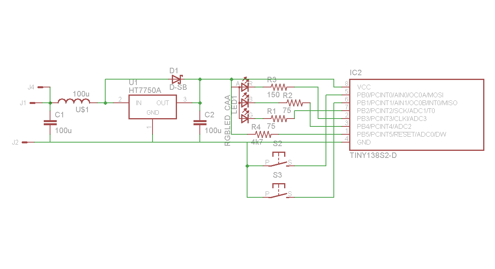

# avr-concert-led

昔、アイドルマスター用に作ったLEDコンサートライトです。
[ブログ](http://attlee.at.webry.info/201007/article_1.html)にUPしていたものをこっちに引っ越しました。
ガーバーデータはどこにも見当たらないので、画像だけ引っ越しです。

# 回路図

# 基板

# 比較

左上がオリジナルとの大きさ比較です。
フック機構の部分が回路とバッテリになりました。
上がその回路部分です。
一箇所ケース作成中にランドが剥がれたのでジャンパしている箇所があります。
右上が回路の裏でバッテリーケージになります。
結局LR44x3構成になりました。
電極は単四の＋－電極を流用しています。ケージ自体は樹脂粘土の手作りになります。
真ん中は白を発光させています。比較のためにオリジナルの白も折って発光させました。
その他は色んな色を光らせています。
